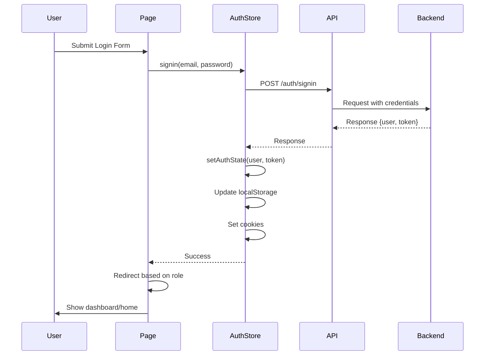

# Phase 2: Authentication Module Enhancement

## Overview

Phase 2 focuses on enhancing the authentication system with improved user experience, better error handling, reusable components, and route protection. This phase builds upon the foundation established in Phase 1 (stores, API client, configuration).

**Status**: 🚧 **IN PLANNING**  
**Start Date**: 2025-12-30  
**Dependencies**: Phase 1 (Foundation) - ✅ COMPLETE

---

## Current State Analysis

### Existing Implementation

| Component | File | Status | Notes |
|-----------|------|--------|-------|
| Login Page | [`storefront/src/pages/login.astro`](../storefront/src/pages/login.astro) | ✅ Basic | Uses old store, needs migration to new auth store |
| Register Page | [`storefront/src/pages/register.astro`](../storefront/src/pages/register.astro) | ✅ Basic | Uses old store, needs migration to new auth store |
| Auth Store | [`storefront/src/stores/auth.ts`](../storefront/src/stores/auth.ts) | ✅ Complete | All auth actions implemented |
| Old Store | [`storefront/src/lib/store.ts`](../storefront/src/lib/store.ts) | ⚠️ Legacy | Will be deprecated after migration |

### Key Issues to Address

1. **Dual Store System**: Currently using both old `lib/store.ts` and new `stores/auth.ts`
2. **Missing Pages**: No forgot-password, verify-account, or update-password pages
3. **No Reusable Components**: Forms are embedded directly in pages
4. **No Middleware**: Routes are not protected
5. **Limited UX**: Missing password visibility toggle, loading states, better error handling
6. **Navbar Integration**: Navbar doesn't reflect auth state

---

## Architecture

### Authentication Flow



### Component Structure

```
storefront/src/
├── components/
│   └── auth/
│       ├── LoginForm.astro          # Reusable login form
│       ├── SignupForm.astro         # Reusable signup form
│       ├── ForgotPasswordForm.astro # Forgot password form
│       ├── UpdatePasswordForm.astro # Update password form
│       └── ProfileDropdown.astro    # User profile dropdown
├── pages/
│   ├── auth/
│   │   ├── signin.astro             # Sign in page (enhanced)
│   │   ├── signup.astro             # Sign up page (enhanced)
│   │   ├── forgot-password.astro    # Forgot password page
│   │   ├── verify-account.astro     # Verify account page
│   │   └── update-password.astro    # Update password page
│   └── account/
│       └── index.astro              # User account page (protected)
├── middleware/
│   └── auth.ts                      # Authentication middleware
└── layouts/
    └── AuthLayout.astro             # Auth-specific layout
```

---

## Implementation Plan

### 2.1 Authentication Pages Enhancement

#### 2.1.1 Sign In Page (`/auth/signin`)

**File**: [`storefront/src/pages/auth/signin.astro`](../storefront/src/pages/auth/signin.astro)

**Changes**:
- Migrate from old `lib/store.ts` to new `stores/auth.ts`
- Add password visibility toggle
- Improve error handling with toast notifications
- Add loading state with spinner
- Add remember me functionality
- Use LoginForm component for reusability

**Features**:
- Email and password inputs with validation
- Password visibility toggle (eye icon)
- Remember me checkbox
- Forgot password link
- Loading state during API call
- Error display with toast
- Role-based redirect (admin → /admin, user → /)

**Reference**: [`refrensi_fe/micro-sayur-nuxt-main/pages/auth/signin.vue`](../refrensi_fe/micro-sayur-nuxt-main/micro-sayur-nuxt-main/pages/auth/signin.vue)

#### 2.1.2 Sign Up Page (`/auth/signup`)

**File**: [`storefront/src/pages/auth/signup.astro`](../storefront/src/pages/auth/signup.astro)

**Changes**:
- Migrate from old `lib/store.ts` to new `stores/auth.ts`
- Add password strength indicator
- Add password confirmation validation
- Improve error handling
- Use SignupForm component for reusability

**Features**:
- Full name, email, password, password confirmation, phone, address inputs
- Password strength indicator (weak/medium/strong)
- Real-time password confirmation validation
- Loading state
- Error display with toast
- Terms and conditions checkbox

**Reference**: [`refrensi_fe/micro-sayur-nuxt-main/components/modals/LoginModal.vue`](../refrensi_fe/micro-sayur-nuxt-main/micro-sayur-nuxt-main/components/modals/LoginModal.vue)

#### 2.1.3 Forgot Password Page (`/auth/forgot-password`)

**File**: [`storefront/src/pages/auth/forgot-password.astro`](../storefront/src/pages/auth/forgot-password.astro)

**New Page**

**Features**:
- Email input
- Submit button with loading state
- Success message with instructions
- Back to login link
- Error handling

**API**: POST `/auth/forgot-password`

#### 2.1.4 Verify Account Page (`/auth/verify-account`)

**File**: [`storefront/src/pages/auth/verify-account.astro`](../storefront/src/pages/auth/verify-account.astro)

**New Page**

**Features**:
- Token-based verification (from URL query param)
- Auto-verify on page load
- Success/error message display
- Redirect to login after verification
- Manual verification option (enter token)

**API**: GET `/auth/verify-account?token=xxx`

#### 2.1.5 Update Password Page (`/auth/update-password`)

**File**: [`storefront/src/pages/auth/update-password.astro`](../storefront/src/pages/auth/update-password.astro)

**New Page**

**Features**:
- New password input
- Password confirmation input
- Password strength indicator
- Token-based (from URL query param)
- Loading state
- Success message with login link
- Error handling

**API**: PUT `/auth/update-password?token=xxx`

---

### 2.2 Auth Components

#### 2.2.1 LoginForm Component

**File**: [`storefront/src/components/auth/LoginForm.astro`](../storefront/src/components/auth/LoginForm.astro)

**Props**:
- `redirectPath?: string` - Custom redirect after login

**Features**:
- Email and password inputs
- Password visibility toggle
- Remember me checkbox
- Forgot password link
- Loading state
- Error display
- Emits `onSuccess` event

#### 2.2.2 SignupForm Component

**File**: [`storefront/src/components/auth/SignupForm.astro`](../storefront/src/components/auth/SignupForm.astro)

**Features**:
- Full name, email, password, password confirmation, phone, address inputs
- Password strength indicator
- Real-time validation
- Loading state
- Error display
- Emits `onSuccess` event

#### 2.2.3 ForgotPasswordForm Component

**File**: [`storefront/src/components/auth/ForgotPasswordForm.astro`](../storefront/src/components/auth/ForgotPasswordForm.astro)

**Features**:
- Email input
- Submit button with loading
- Success message
- Error display
- Emits `onSuccess` event

#### 2.2.4 UpdatePasswordForm Component

**File**: [`storefront/src/components/auth/UpdatePasswordForm.astro`](../storefront/src/components/auth/UpdatePasswordForm.astro)

**Props**:
- `token: string` - Password reset token

**Features**:
- New password input
- Password confirmation input
- Password strength indicator
- Loading state
- Success message
- Error display
- Emits `onSuccess` event

#### 2.2.5 ProfileDropdown Component

**File**: [`storefront/src/components/auth/ProfileDropdown.astro`](../storefront/src/components/auth/ProfileDropdown.astro)

**Features**:
- User avatar and name display
- Dropdown menu with:
  - My Profile link
  - My Orders link
  - Logout button
- Responsive design
- Emits `onLogout` event

**Reference**: [`refrensi_fe/micro-sayur-nuxt-main/components/admin/ProfileDropdown.vue`](../refrensi_fe/micro-sayur-nuxt-main/micro-sayur-nuxt-main/components/admin/ProfileDropdown.vue)

---

### 2.3 Navigation Integration

#### 2.3.1 Update Navbar Component

**File**: [`storefront/src/components/shared/Navbar.astro`](../storefront/src/components/shared/Navbar.astro)

**Changes**:

**For Unauthenticated Users**:
- Show "Sign In" button (links to `/auth/signin`)
- Show "Sign Up" button (links to `/auth/signup`)
- Show cart icon (always visible)

**For Authenticated Users**:
- Show ProfileDropdown component
- Show cart icon with item count
- Hide Sign In/Sign Up buttons

**Implementation**:
```astro
---
import { $isAuthenticated, $authUser } from '../stores/auth';
const isAuthenticated = $isAuthenticated.get();
const user = $authUser.get();
---

<!-- Unauthenticated state -->
{!isAuthenticated && (
  <>
    <a href="/auth/signin">Sign In</a>
    <a href="/auth/signup">Sign Up</a>
  </>
)}

<!-- Authenticated state -->
{isAuthenticated && (
  <ProfileDropdown user={user} />
)}
```

---

### 2.4 Middleware & Route Protection

#### 2.4.1 Auth Middleware

**File**: [`storefront/src/middleware/auth.ts`](../storefront/src/middleware/auth.ts)

**Purpose**: Protect routes that require authentication

**Implementation**:
```typescript
import { defineMiddleware } from 'astro:middleware';
import { getTokenFromCookie } from '../stores/auth';

export const onRequest = defineMiddleware((context, next) => {
  const token = getTokenFromCookie();
  const { url } = context;

  // Define protected routes
  const protectedRoutes = ['/admin', '/account'];
  const isProtectedRoute = protectedRoutes.some(route => 
    url.pathname.startsWith(route)
  );

  // Redirect to login if trying to access protected route without token
  if (isProtectedRoute && !token) {
    return context.redirect('/auth/signin?redirect=' + encodeURIComponent(url.pathname));
  }

  // Redirect authenticated users away from auth pages
  const authRoutes = ['/auth/signin', '/auth/signup'];
  if (authRoutes.includes(url.pathname) && token) {
    return context.redirect('/');
  }

  return next();
});
```

**Note**: Astro middleware runs on the server, so we need to handle cookie parsing differently. We may need to use Astro's `cookies` API.

#### 2.4.2 Protected Routes

| Route | Protection Level | Redirect (if not auth) |
|-------|-----------------|------------------------|
| `/admin/*` | Admin only | `/auth/signin` |
| `/account/*` | Any user | `/auth/signin` |
| `/auth/signin` | Unauthenticated only | `/` |
| `/auth/signup` | Unauthenticated only | `/` |

---

### 2.5 Form Validation & Error Handling

#### 2.5.1 Client-side Validation

**Validation Rules**:
- Email: Valid email format
- Password: Minimum 8 characters
- Password Confirmation: Must match password
- Phone: Valid phone number format
- Required fields: All marked as required

**Implementation**:
- Use HTML5 built-in validation
- Add custom JavaScript validation for complex rules
- Show inline error messages

#### 2.5.2 Loading States

**All forms should show**:
- Disabled submit button during API call
- Loading spinner or text
- Prevent double submission

#### 2.5.3 Error Display

**Toast Notification System**:
- Create a simple toast notification utility
- Show success/error messages
- Auto-dismiss after 5 seconds
- Stack multiple notifications

**Implementation**:
```typescript
// storefront/src/lib/toast.ts
export function showToast(message: string, type: 'success' | 'error' = 'success') {
  // Create toast element
  // Add to DOM
  // Auto-remove after 5 seconds
}
```

#### 2.5.4 Password Strength Indicator

**Criteria**:
- Weak: < 8 characters
- Medium: 8+ characters, no special chars
- Strong: 8+ characters, includes special chars and numbers

**Visual**:
- Progress bar with color coding (red → yellow → green)
- Text label (Weak/Medium/Strong)

---

### 2.6 UI/UX Improvements

#### 2.6.1 Password Visibility Toggle

**Implementation**:
- Eye icon button next to password field
- Toggle between `type="password"` and `type="text"`
- Update icon (eye/eye-off)

#### 2.6.2 Remember Me Functionality

**Implementation**:
- Checkbox in login form
- If checked, set cookie with longer expiry (30 days)
- If not checked, set cookie with session expiry

#### 2.6.3 Responsive Design

**Mobile**:
- Single column layout
- Full-width inputs
- Larger touch targets

**Desktop**:
- Two-column layout (image + form)
- Centered form card
- Proper spacing

---

## Success Criteria

### Authentication Module

- [ ] User can sign in with valid credentials
- [ ] User can sign up with valid data
- [ ] User can request password reset
- [ ] User can verify account via email link
- [ ] User can update password via reset link
- [ ] Auth middleware protects admin routes
- [ ] Auth middleware protects user account routes
- [ ] Unauthenticated users are redirected from protected routes
- [ ] Authenticated users are redirected from auth pages
- [ ] Navbar shows correct auth state
- [ ] Profile dropdown displays user info
- [ ] Logout clears auth state and redirects
- [ ] Cookies are set correctly for SSR
- [ ] Forms show loading states
- [ ] Errors are displayed with toast notifications
- [ ] Password visibility toggle works
- [ ] Password strength indicator works
- [ ] Remember me functionality works
- [ ] All pages are responsive

---

## Migration Strategy

### Step 1: Create New Auth Pages
- Create `/auth/signin.astro` (new, enhanced)
- Create `/auth/signup.astro` (new, enhanced)
- Create `/auth/forgot-password.astro`
- Create `/auth/verify-account.astro`
- Create `/auth/update-password.astro`

### Step 2: Create Reusable Components
- Create `LoginForm.astro`
- Create `SignupForm.astro`
- Create `ForgotPasswordForm.astro`
- Create `UpdatePasswordForm.astro`
- Create `ProfileDropdown.astro`

### Step 3: Update Navbar
- Integrate auth state checking
- Add ProfileDropdown for authenticated users
- Add Sign In/Sign Up buttons for unauthenticated users

### Step 4: Create Middleware
- Create `middleware/auth.ts`
- Configure protected routes

### Step 5: Add Utilities
- Create toast notification system
- Add form validation helpers

### Step 6: Update Existing Pages (Optional)
- Keep old `/login.astro` and `/register.astro` for backward compatibility
- Add redirect to new auth pages
- Or delete and update all references

### Step 7: Testing
- Test all authentication flows
- Test protected routes
- Test error scenarios
- Test responsive design

---

## Dependencies

### External Dependencies
- None (all dependencies from Phase 1)

### Internal Dependencies
- ✅ Phase 1 stores ([`stores/auth.ts`](../storefront/src/stores/auth.ts))
- ✅ Phase 1 API client ([`lib/api.ts`](../storefront/src/lib/api.ts))
- ✅ Phase 1 types ([`types/api.ts`](../storefront/src/types/api.ts))

---

## Files to Create

```
storefront/src/
├── components/
│   └── auth/
│       ├── LoginForm.astro
│       ├── SignupForm.astro
│       ├── ForgotPasswordForm.astro
│       ├── UpdatePasswordForm.astro
│       └── ProfileDropdown.astro
├── pages/
│   └── auth/
│       ├── signin.astro
│       ├── signup.astro
│       ├── forgot-password.astro
│       ├── verify-account.astro
│       └── update-password.astro
├── middleware/
│   └── auth.ts
└── lib/
    └── toast.ts
```

## Files to Modify

```
storefront/src/
├── components/
│   └── shared/
│       └── Navbar.astro
└── pages/
    ├── login.astro (optional: redirect or delete)
    └── register.astro (optional: redirect or delete)
```

---

## API Endpoints Used

| Endpoint | Method | Auth Required | Description |
|----------|--------|---------------|-------------|
| `/auth/signin` | POST | No | User login |
| `/auth/signup` | POST | No | User registration |
| `/auth/forgot-password` | POST | No | Request password reset |
| `/auth/verify-account` | GET | No | Verify account with token |
| `/auth/update-password` | PUT | No | Update password with token |
| `/auth/profile` | GET | Yes | Get user profile |
| `/auth/profile` | PUT | Yes | Update user profile |

---

## Testing Checklist

### Unit Tests (if applicable)
- [ ] Auth store actions work correctly
- [ ] Token management functions work
- [ ] Cookie functions work

### Integration Tests
- [ ] Login flow works end-to-end
- [ ] Signup flow works end-to-end
- [ ] Password reset flow works end-to-end
- [ ] Account verification flow works end-to-end
- [ ] Protected routes redirect correctly
- [ ] Auth state persists across page reloads

### Manual Testing
- [ ] Test with valid credentials
- [ ] Test with invalid credentials
- [ ] Test with empty fields
- [ ] Test password strength indicator
- [ ] Test password visibility toggle
- [ ] Test remember me functionality
- [ ] Test logout
- [ ] Test responsive design on mobile
- [ ] Test responsive design on tablet
- [ ] Test responsive design on desktop

---

## Known Issues & Considerations

1. **Astro Middleware Limitations**: Astro middleware runs on the server and has limited access to browser APIs. Cookie handling needs careful implementation.

2. **SSR vs Client State**: Need to ensure auth state is properly hydrated on both server and client.

3. **Token Expiry**: Need to handle token expiry gracefully and prompt re-authentication.

4. **Role-based Access**: Admin routes need additional role checking beyond just authentication.

5. **Social Login**: Not in scope for this phase, but consider adding placeholders for future implementation.

---

## Next Steps

1. Review and approve this plan
2. Switch to Code mode to implement
3. Follow the implementation order:
   - Create components first
   - Create pages using components
   - Update navigation
   - Create middleware
   - Add utilities
   - Test thoroughly

---

**Document Version**: 1.0  
**Created**: 2025-12-30  
**Status**: Planning 🚧
